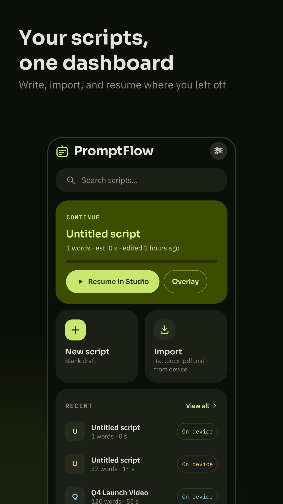
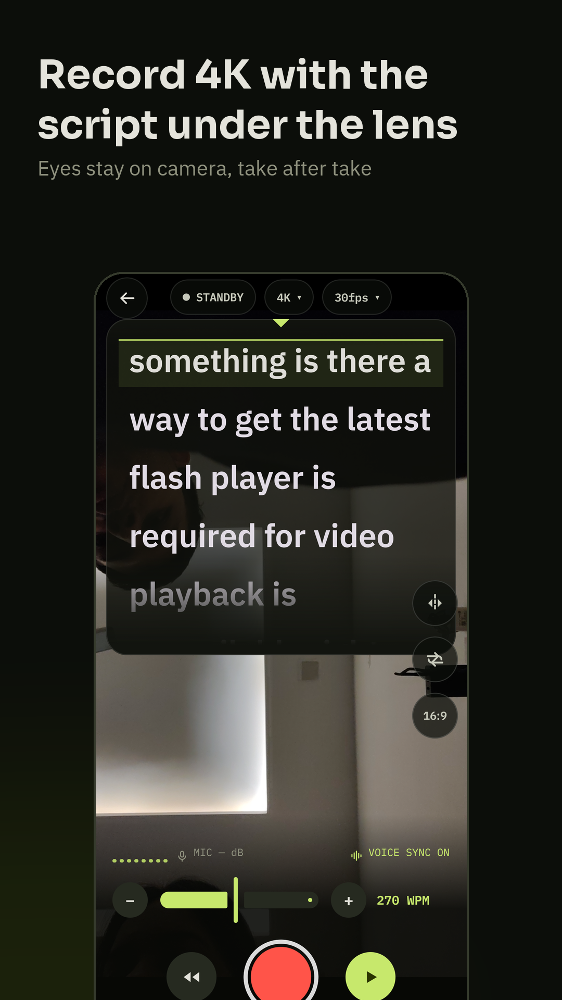
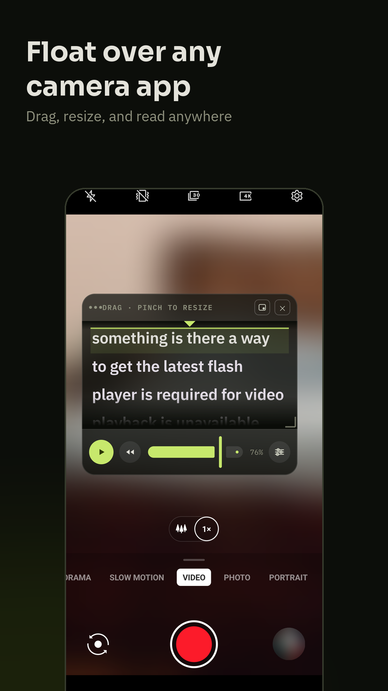
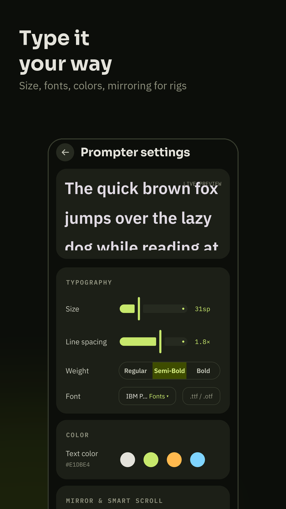

<div align="center">

# PromptFlow

**A teleprompter for creators — floats over any camera app, records in 4K, and follows your voice.**

[](https://play.google.com/store/apps/details?id=com.vivekkaushik.promptflow)

[Play Store](https://play.google.com/store/apps/details?id=com.vivekkaushik.promptflow) · [Privacy policy](docs/privacy-policy.html) · [Changelog](CHANGELOG.md)

</div>

---

## What it does

Reading a script on camera usually means looking away from the lens. PromptFlow puts the script
where you're already looking — either floating over your favourite camera app, or inside its own
recording studio — and scrolls it at the pace you actually speak.

- **Floating overlay** — a draggable, resizable prompter window over any app: your camera,
  Instagram, TikTok, a video call. Collapses to a bubble between takes.
- **Built-in studio** — record up to 4K/60 with the script hovering under the lens. Tap-to-focus,
  pinch zoom, exposure, torch, rule-of-thirds grid, 16:9 / 4:3 / 1:1 framing.
- **Voice sync** — on-device speech recognition keeps the line you're reading in the guide band.
  Speed up, slow down, pause to think; the script follows you.
- **Script markers** — `## Section` headers, `[[pause]]` stops, `[[pause 3s]]` timed holds and
  `[[b-roll: …]]` stage directions. Markers never count as spoken words, so duration estimates
  and voice sync stay accurate.
- **Takes** — every recording is linked back to the script it was read from, with thumbnails.
- **Import** — `.txt`, `.docx`, `.pdf`, `.md`.
- **Made for rigs** — horizontal/vertical mirroring for beam-splitter glass, volume-key and
  Bluetooth remote control, start-delay countdown.
- **Private by design** — no account, no cloud, no analytics. Scripts and settings live only on
  your device; recordings go to your own gallery.

## Screenshots

<div align="center">




</div>

## Build

Requires JDK 17+ (the Android Studio JBR works) and the Android SDK with API 36.

```bash
./gradlew :app:assembleDebug
```

```bash
./gradlew :app:testDebugUnitTest
```

Release builds are signed from a gitignored `keystore.properties` — copy
[`keystore.properties.example`](keystore.properties.example) and fill it in. Without it the
release build is unsigned.

```bash
./gradlew :app:bundleRelease
```

## Releasing

[Fastlane](fastlane/Fastfile) lanes handle the Play Store; the `versionCode` is pulled from the
Play Console automatically, so nothing needs bumping by hand.

| Lane | What it does |
|------|--------------|
| `internal` | tests → signed `.aab` → Internal testing track |
| `beta` | same, to the closed beta track |
| `production` | same, straight to production |
| `promote` | promotes the current internal build to production, no rebuild |

Pushing a `v*` tag runs the internal lane on GitHub Actions
([workflow](.github/workflows/release.yml)); the track is selectable for manual runs. Signing and
Play credentials come from repository secrets — see the workflow for the list.

Store listing text and graphics live in
[`fastlane/metadata/android/en-US/`](fastlane/metadata/android/en-US) and upload with each release.
The [privacy policy](docs/privacy-policy.html) is published to GitHub Pages by
[its own workflow](.github/workflows/pages.yml).

## Architecture

Single-activity Compose app, no external state framework — one shared prompter engine drives every
surface, so speed and read position survive switching between Studio and the overlay.

```
app/src/main/java/com/vivekkaushik/promptflow/
├── Graph.kt                    service locator: db, settings, engine, speech sync
├── MainActivity.kt             NavHost, hardware-remote key handling, overlay launch
├── core/
│   ├── data/                   Room entities + DAOs (scripts, takes), DataStore settings
│   ├── prompter/               PrompterEngine (scroll clock), ScriptMarkup (marker parser)
│   ├── speech/                 SpeechSync — recognizer + fuzzy word alignment
│   └── importer/               .txt / .docx / .pdf / .md import
├── feature/
│   ├── library/                bento dashboard, All Scripts
│   ├── editor/                 script editor, marker toolbar, takes strip
│   ├── studio/                 CameraX viewfinder, camera controls, recording
│   ├── overlay/                foreground service + floating window
│   └── settings/               typography, mirroring, licenses
└── ui/                         theme tokens, prompter viewport, shared components
```

**Key pieces**

- `PrompterEngine` — one 16 ms tick loop; scroll velocity is derived from WPM and the *measured*
  text height, eased over ~400 ms. Voice sync steers that velocity rather than jumping the position.
- `PrompterViewport` — reports each word's real laid-out pixel offset back to the engine, so voice
  sync, pause markers and section jumps land on the right line.

Storage is Room (v3) plus DataStore preferences. Nothing leaves the device.

## Tech

Kotlin · Jetpack Compose (Material 3) · CameraX · Room · DataStore · Navigation Compose ·
`SpeechRecognizer` · PdfBox-Android · Google Fonts (Downloadable Fonts)

Minimum Android 9 (API 28), targets API 36.

## Licence

PromptFlow is licensed under the [Apache License 2.0](LICENSE).

```
Copyright 2026 Vivek Kaushik

Licensed under the Apache License, Version 2.0 (the "License");
you may not use this file except in compliance with the License.
You may obtain a copy of the License at

    http://www.apache.org/licenses/LICENSE-2.0
```

Open-source dependencies and their licences are listed in the app under
**Settings → About → Open-source libraries**.
